# python协同过滤算法在线课程推荐系统

#### 介绍

python基于协同过滤算法教学资源推荐系统，采用基于流行度的热点推荐，推荐点击量较多的课程；同时采用基于用户与基于物品的协同过滤推荐算法，如果基于用户与基于物品的协同过滤推荐算法均没有推荐结果，采用兴趣标签推荐，随机查询当前登录用户的兴趣标签中的课程，同时过滤当前登录用户已经评分、收藏、点赞的课程。数据分析，数据爬虫

#### 项目说明

基于django框架在线课程推荐系统的设计与开发 python个性化网上课程/网课/学习资源平台推荐系统 排行榜、爬虫、兴趣标签 热点推荐 兴趣标签推荐 协同过滤算法推荐 混合推荐 深度学习 机器学习 大数据WebCourseRecommendPy

一、项目简介

1、开发工具和使用技术

Pycharm、Python3及以上版本，Django3.6及以上版本，mysql8，navicat数据库管理工具，html页面，javascript脚本，jquery脚本，bootstrap前端框架，echarts可视化图表组件等。

2、实现功能

前台首页地址：http://127.0.0.1:8000/
后台首页地址：http://127.0.0.1:8000/admin
管理员账号：admin 管理员密码：admin

用户功能：登录、注册、密码重置、修改信息、修改密码、兴趣标签、课程搜索排序、可视化数据、个性化推荐、标签推荐、流行度推荐、课程收藏、课程评分、课程点赞、课程评论等；

管理员功能：登录、数据统计、修改信息、修改密码、课程类型管理、课程管理、用户管理、兴趣标签管理、课程收藏管理、课程评分管理、课程点赞管理、课程评论管理、管理员管理等。

推荐课程：

用户没有登录，采用基于流行度的热点推荐，推荐点击量较多的课程；
用户已经登录，采用基于用户与基于物品的协同过滤推荐算法，
如果基于用户与基于物品的协同过滤推荐算法均没有推荐结果（冷启动和数据稀疏性问题造成没有推荐结果），采用兴趣标签推荐，随机查询当前登录用户的兴趣标签中的课程，同时过滤当前登录用户已经评分、收藏、点赞的课程。

你可能还喜欢：

随机查询当前课程的课程类型下的课程，同时过滤当前课程和当前登录用户已经评分、收藏、点赞的课程。

可视化数据：饼状图、柱状图、词云图。

课程数据来源：爬取中国大学慕课网站课程数据。

二、项目展示
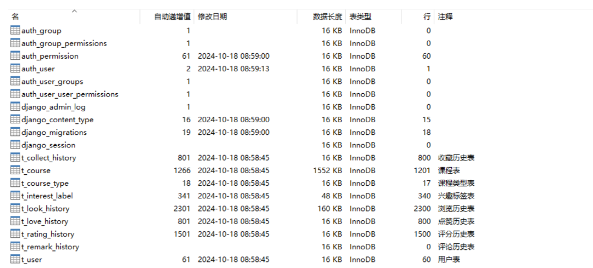
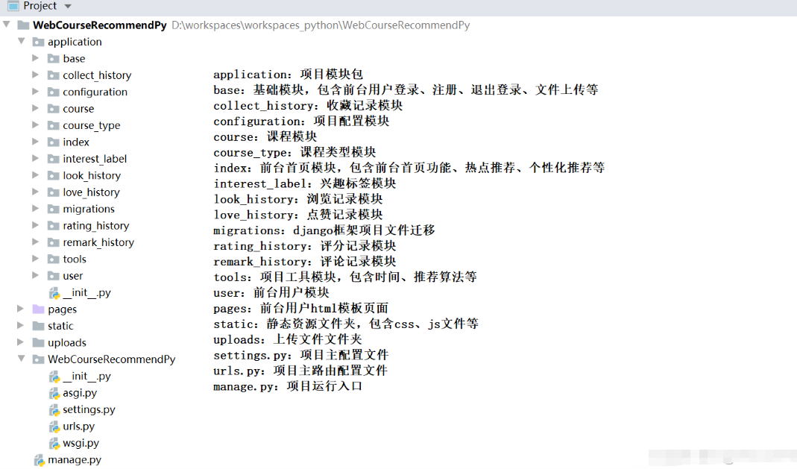

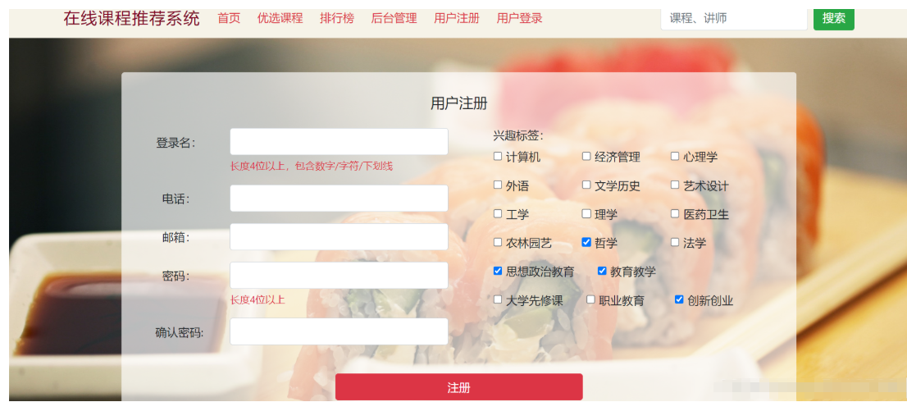
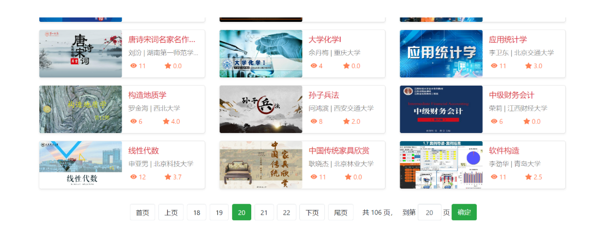
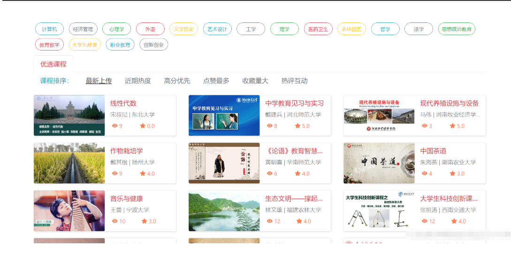
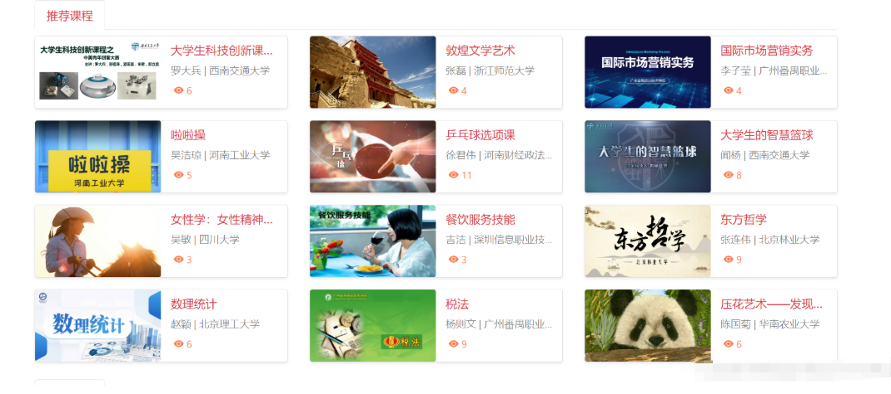
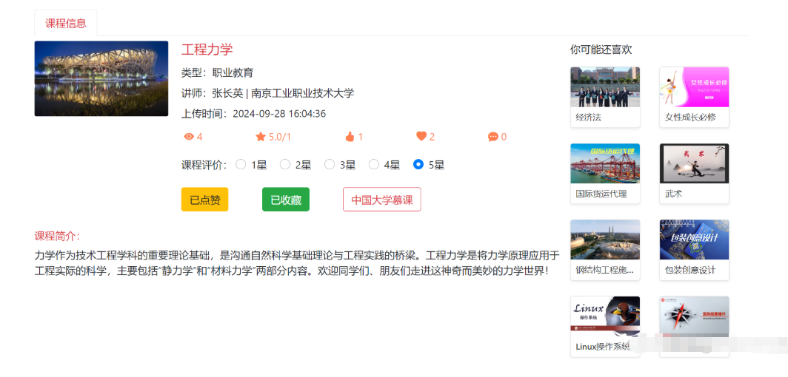
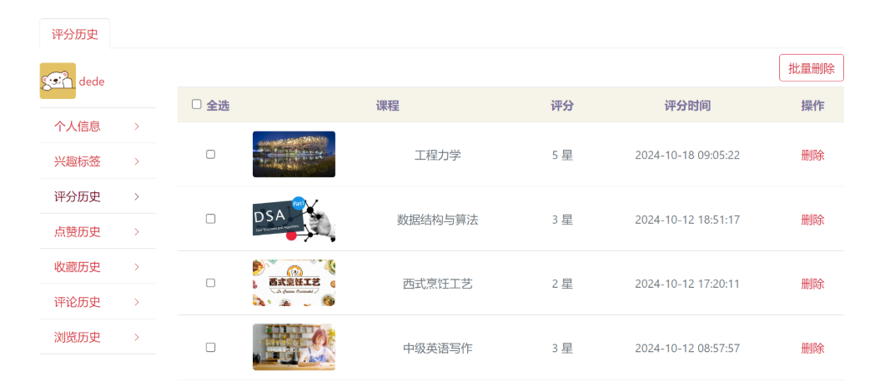

## 后台管理系统

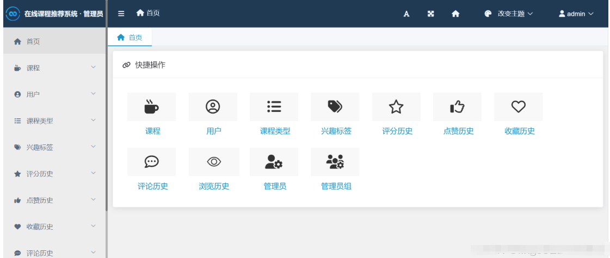
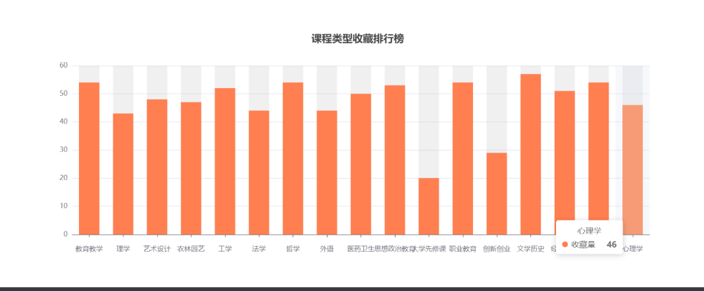
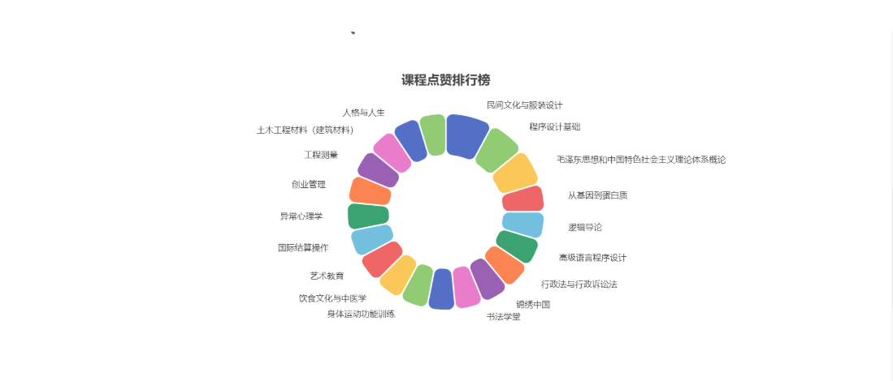
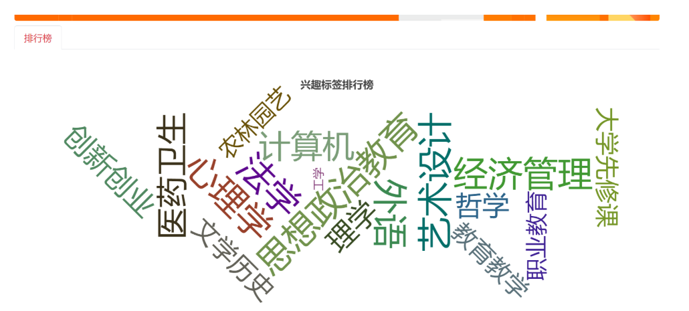
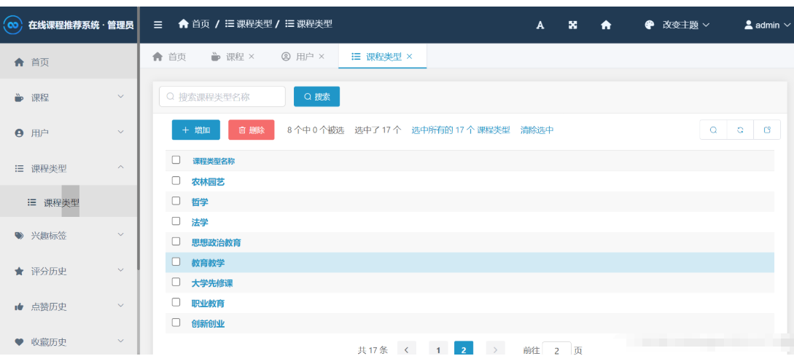
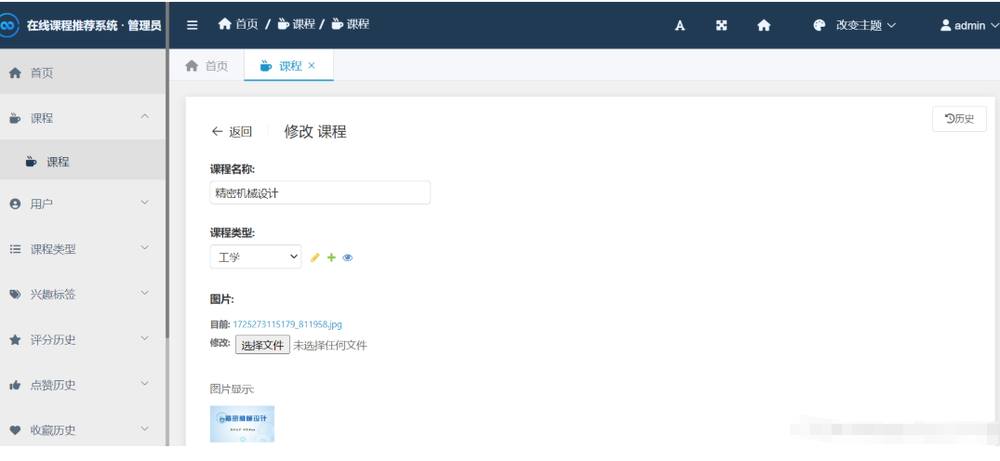
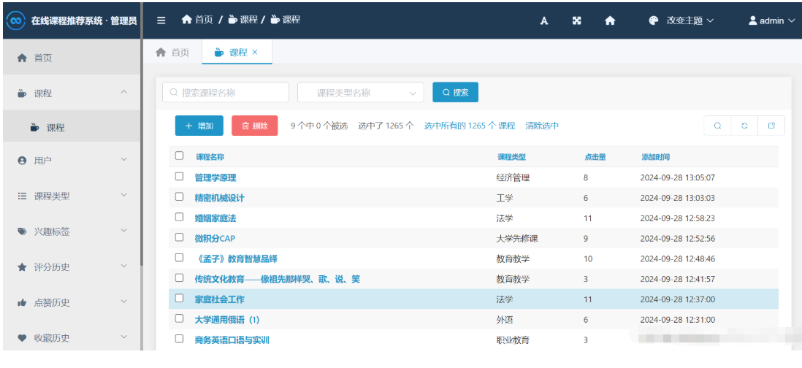

## 推荐算法展示
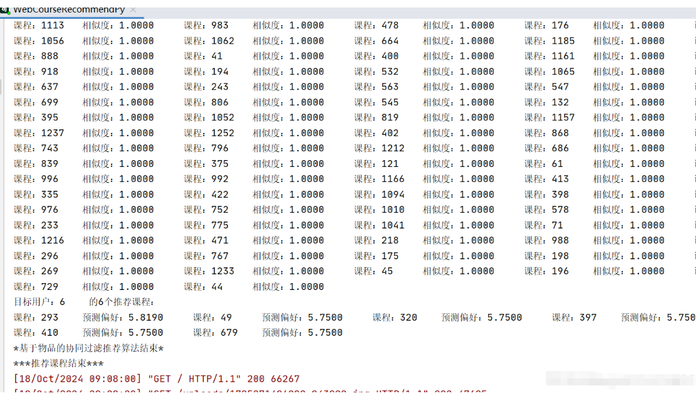
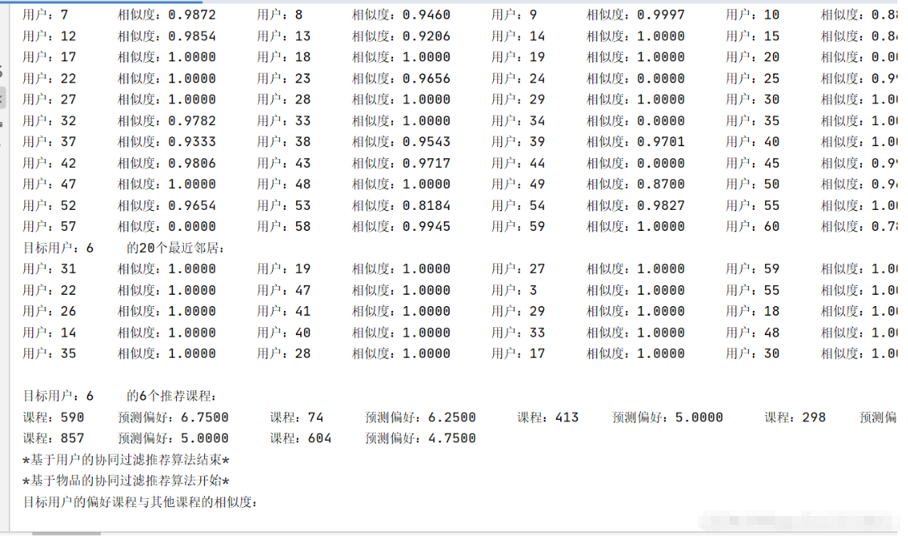

## 代码展示
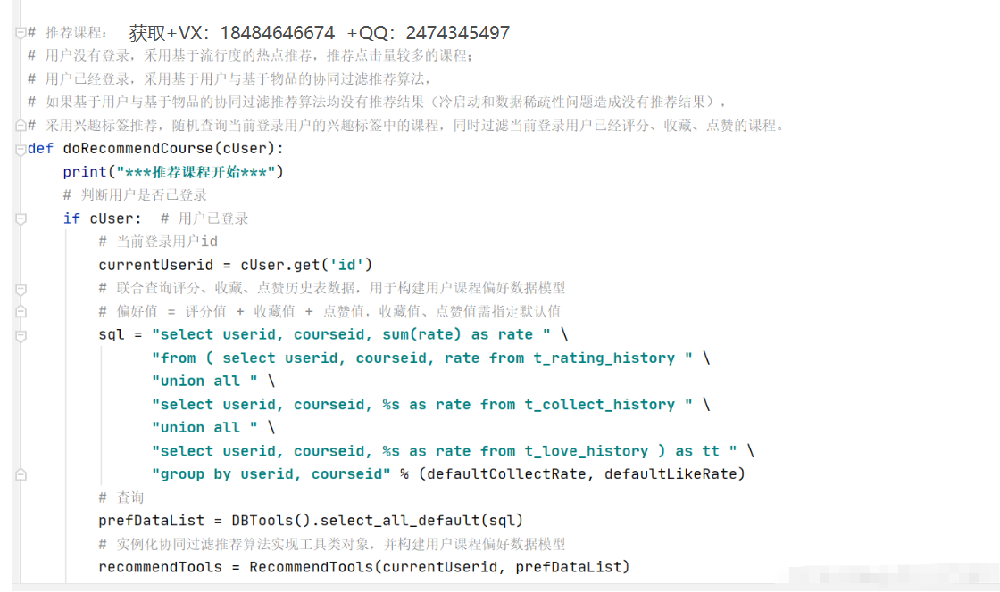

## 图片如果看不了，请开VPN刷新查看
## 源码获取+VX：18484646674  +QQ：2474345497

